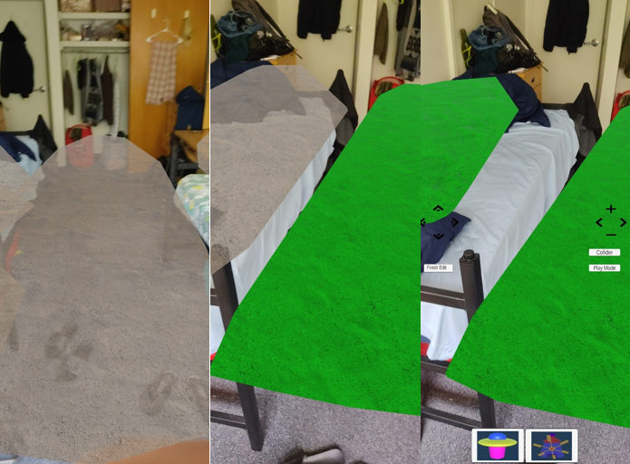

# Virtual Reality
## Assignment 4: Augmented Reality

**Name:** Prateek Sengar  

---

In this assignment, I implemented an application that enables users to Build-and-Play Mini-Golf in AR. The functionality to create and play on augmented 3D scenes in the actual world has been implemented for this assignment.

### Modes
- **Build Mode**: Create a mini-golf course by setting up the necessary elements in the AR world.
- **Play Mode**: The user can now play the course they created using this mode.

**Unity Version:** 2020.3.25

## Selecting the Game Planes
For the plane selection, the user can see all the planes in the physical environment. The user can select the plane by tapping on the plane (it turns green on touch), and the limit to selecting planes is 2. The user is able to select 1 Ground plane and 1 Elevated plane.

## Physical-World Interactor Preparation
### 1. Physical World Setup
I used the QR code AR marker to create markers. I used 4 markers, 1 for the start flag, 1 for the end/par flag, and 2 teleportation markers. The markers are placed in the Textures Folder in the project folder with the corresponding names (StartFlag, etc.).

### 2. Virtual Setup
Next, we can scan these QR codes to spawn respective flags. The images below show the same:
- Red -> End/Par Flag
- Green -> Transportation Flag
- White -> Start Flag

## Build Mode (Placement)
As soon as the 2 planes (1 ground and 1 Elevated) are selected, the build mode is automatically activated. The user has the option to place a collider, finish editing after the object placement, and switch to play mode. Also, the user has the option to move the objects they placed (collider box, UFO, Windmill) and rotate them (Windmill and UFO) as well as scale the collider.

B1: Place the collider on real world objects. Click the Collider button to place the cube. Move it around with the arrow buttons on the left, scale it up and down using the + and - buttons on the right. The ball cannot get past the collider even if we try to swipe it past it. Images left to right, click on collider spawns a collider, then move it around using the arrow keys, scale it up and down using the + and – buttons and finally when placed by clicking the finish edit button, it gets places perfectly on the plane.

B2: Now to place the virtual objects in real world, we have two options, placing the windmill and the UFO. When placing the UFO, we can move it around using the arrows keys on the left and can rotate it using the arrows keys on the right. When the UFO is placed using finish edit, it starts to circle around a fixed path. Also, when the ball comes under its rays, it gets teleported back to the start. Similarly, we can place and rotate the windmill as well. Images left to right, UFO placed and when finish edit starts revolving around a path.

For the Windmill as well, placed and rotated. 

## Play Mode
When the Play Mode button is pressed, the build mode is turned off, and all the buttons disappear. All the objects placed in the build mode appear in their fixed places, and a gold ball is spawned near the start flag. The ball can be moved using a finger swipe. The ball can teleport using the teleport flags from the Elevated plane to the ground plane and vice versa. Also, the ball can be teleported back to the start flag if it's under the rays of the UFO. The ball can fall from the elevated surface to the ground surface, and when it falls off the boundaries of any of the planes, it is spawned back to the start plane.

## Hierarchy

References 
1. WindMill: "Animated Low Poly Mini Golf Windmill" (https://skfb.ly/oqZxW) by Designed By Jonathan is licensed under Creative Commons Attribution (http://creativecommons.org/licenses/by/4.0/).
2. Google AR Tutorial + Code snippets - https://codelabs.developers.google.com/arcore-unity-ar-foundation#0 
3. GLTFUtility-0.7 (For importing windmill) - https://github.com/Siccity/GLTFUtility/releases/tag/0.7 
4. Hit Ball - https://www.youtube.com/watch?v=7O9bAFyGvH8&ab_channel=AlexanderZotov 
5. Channel - https://www.youtube.com/@DevEnabled (Unity AR playlist)
6. Place Flag on QR - https://www.youtube.com/watch?v=I9j3MD7gS5Y&ab_channel=DevEnabled [Code used]
7. Channel - https://www.youtube.com/@samyam (Plane Detection and Object Placement Videos)
8. Plane Detection - https://www.youtube.com/watch?v=pBEGvd2akTY&t=761s&ab_channel=DineshPunni 
9. White & Black GUI by Gamertose - https://assetstore.unity.com/packages/2d/gui/icons/white-black-gui-by-gamertose-168805 
10. Generate QR - https://shawnlehner.github.io/ARMaker/ 
